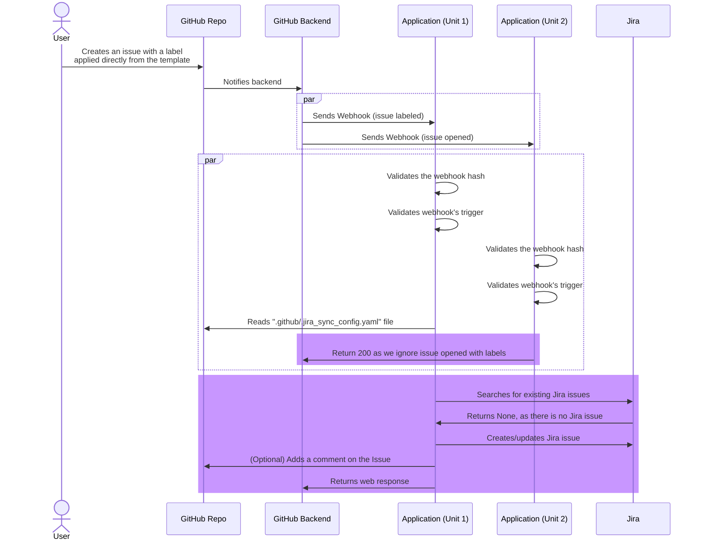

To mitigate the bug causing duplicate issues (Ref: https://github.com/canonical/gh-jira-sync-bot/issues/57), 
we can introduce a condition to check if the `issue.opened` webhook includes a `labels` field in 
its payload. If the `labels` field is present, we can safely skip processing the `issue.opened` webhook, 
knowing that a subsequent `issue.labeled` webhook will arrive to handle the labeling.

Example payload [issue_created_with_label.json](tests/unit/payloads/issue_created_with_label.json)

This will change the architecture as per diagram, with main change highlighted in purple

