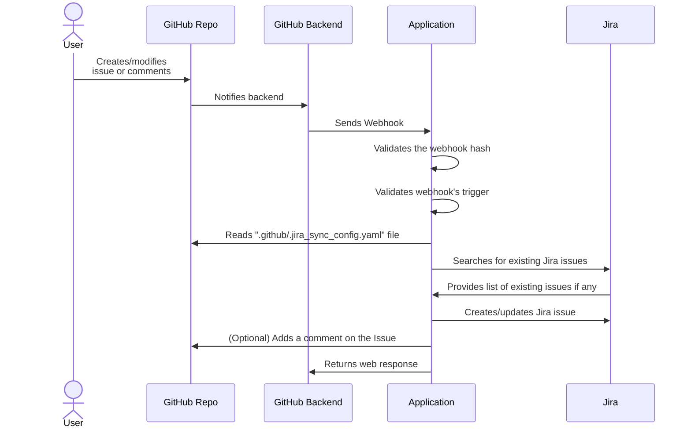
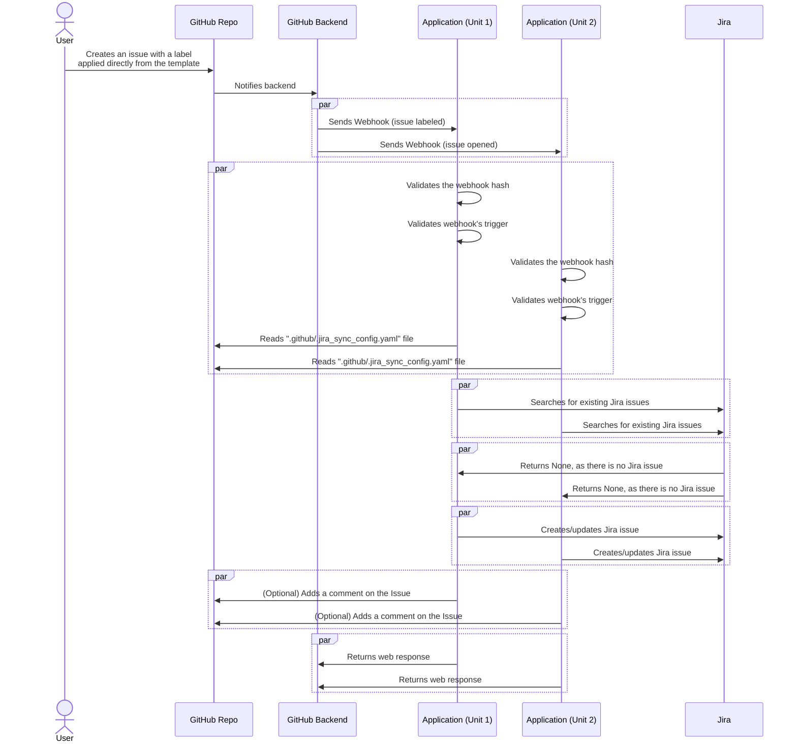

# General workflow

# Issue created from template (with labels)

This diagram illustrates a corner case scenario when issue is created from GitHub issue template that contains Labels.
In this case GitHub sends two webhooks in parallel that causes issues in the asynchronous (stateless) service.

